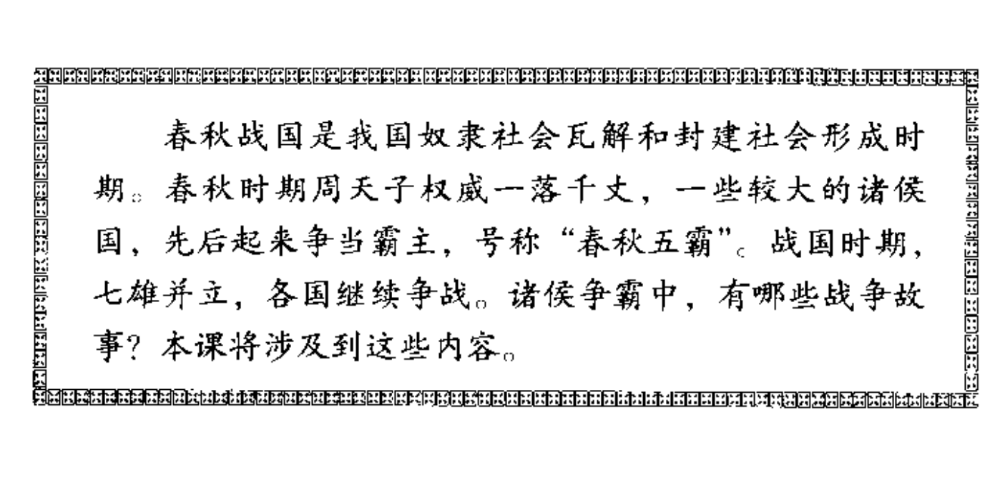
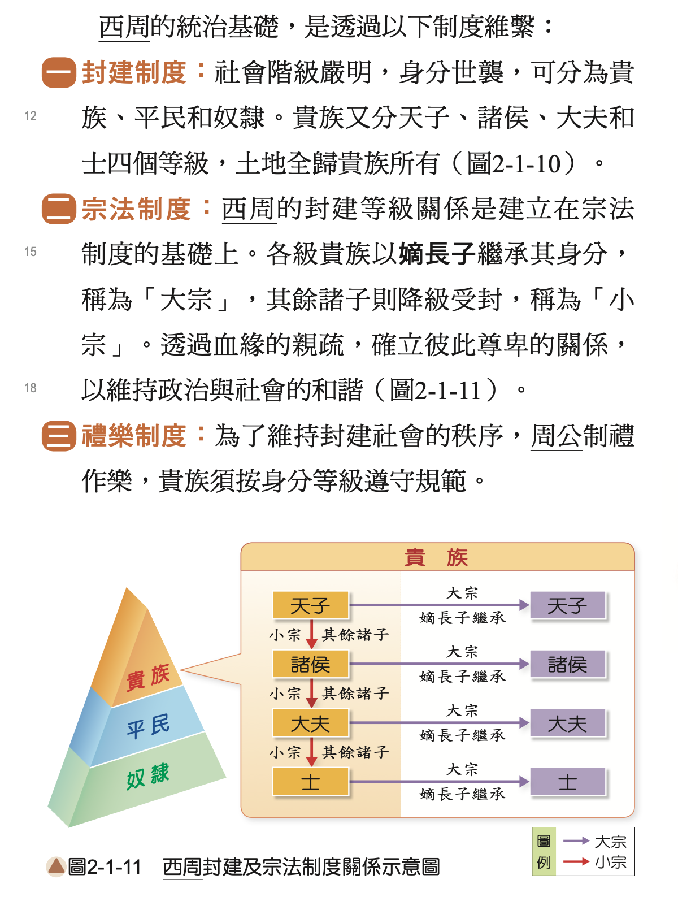

中国教材（人教版2001初中历史、2003高中美术，我相信现在亦如此）：把夏、商、西周定义为奴隶社会。是为了共产党的历史观，是为了更符合马克思的五段发展。奴隶社会→封建社会→资本主义→共产主义。

不是很同意这个结论。台湾的国中教材中国史（99课纲版）直接把西周认定为封建制度。虽然西周有奴隶的存在，但绝不是生产主力。

曹操写“周公吐哺，天下归心”，孔子感慨“礼崩乐坏”，我觉得周朝应该还是不错的。

这种认为夏商周可能不是奴隶社会的叫做“无奴派”。何炳棣的《商周奴隸社會說糾謬》很有说服力，中国的奴隶根本就没有很多，占比很少，而且也不从事生产。

- [无奴派](https://zh.wikipedia.org/zh-tw/无奴派)
- [商周奴隸社會說糾謬](https://www.rchss.sinica.edu.tw/files_news/07-02-1995/07_2_4.pdf)

> 奴隸的通性有三：一、奴隸是屬於主人的，可以買賣的「物」和「動產」，不具有人的權利與義務；二、奴隸與原來所屬的種族、邦國、宗教、家族的關係完全已被根拔；三、奴隸永是社會的「外方人」。只有依靠奴隸為生產主力的古今社會，才能被稱為奴隸社會。

> 以上列奴隸三個基本特徵與商周考古及文獻資料相核證的結果是：佔商代人口極大多數的「隸」和佔周代人口極大多數的「庶人」都是享有室家的平民，都不是奴隸；即使周代被認為「卑賤」的「皁、隸、圉、牧」也還各有家室，都是下級的職事人員，不是奴隸。在商代只有被擄的「羌」和其他異族的人是奴隸；在周代只有「罪隸」和異族戰俘是奴隸。真正的奴隸在全人口中既微不足道而且很少從事生產，商周社會決無法被認為是奴隸社會。

